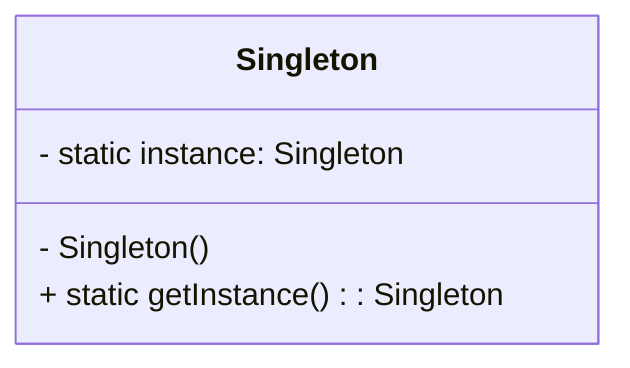

# Singleton Pattern

## Introduction  
The **Singleton Pattern** is a **creational design pattern** that ensures a class has only **one instance** and provides a global access point to that instance. This is useful when you need a **single source of truth** across your application, such as a **configuration manager, database connection, or logging system**.

## Key Concepts   
**Single Instance**: Only one instance of the class exists.  
**Global Access**: The instance is accessible from anywhere.  
**Initialization**:  
  - **Eager Initialization**: The instance is created as soon as the application starts or when the class is loaded into memory.
  - **Lazy Initialization**: The instance is created only when it is actually needed, helping with resource management, especially for expensive objects.

## UML Diagram  

## Why is it considered by some people an anti-pattern?
While the **Singleton Pattern** is a well-known design pattern, many developers, consider it an **anti-pattern**.

## Reasons for Considering Singleton as an Anti-Pattern

### 1. **Difficult to Unit Test**
Singletons are difficult to test in isolation. Since they control the creation of the instance and often maintain a global state, **unit testing** becomes challenging.  

- **Problem**: If the Singleton pattern is used for things like database connections or global settings, **mocking** or **stubbing** the Singleton instance in tests could be hard.
  
- **Example**: In **TypeScript**, mocking a Singleton instance can be tricky, as the class is already instantiated and hard to isolate from the test environment. This makes tests **less predictable**.

### 2. **Hidden Dependencies**
The Singleton pattern creates **hidden dependencies** between classes and the Singleton instance, which makes the code **less readable** and harder to understand.

- **Problem**: It can be difficult to tell which parts of the code are relying on the Singleton instance, leading to a **tight coupling** between components.
  
- **Example**: In a large **JavaScript** codebase, if multiple modules are indirectly relying on the Singleton, adding new features or making changes becomes more risky, as the impact of changes is **unpredictable**.

### 3. **Breaks Single Responsibility Principle (SRP)**
The Singleton pattern often violates the **Single Responsibility Principle** because the class is responsible for both the **creation of the instance** and the **business logic**.

- **Problem**: By combining both responsibilities, the Singleton class becomes **overloaded** with tasks, making it harder to maintain and test.
  
- **Example**: In **TypeScript**, a Singleton that handles configuration management and logging might be responsible for too many concerns, making it hard to extend or modify individual functionalities.

## Use Cases
The Singleton pattern is commonly used in the following scenarios:

- **Configuration management**: To ensure a single configuration object is used across the entire system.
- **Logging systems**: A single logger instance to capture logs throughout an application.
- **Database connections**: To prevent multiple database connections and ensure efficient resource use.

## When to Use Singleton Pattern
You should consider using the Singleton pattern when:

- There is a clear need for **global access** to a resource (e.g., logging or configuration).
- The class should have only **one instance**, and this instance should be shared across multiple components.
