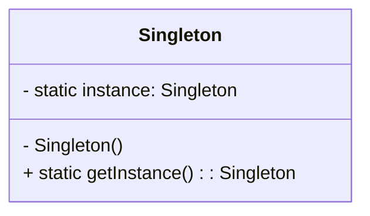

# Patrón Singleton

## Introducción  
El **Patrón Singleton** es un **patrón de diseño creacional** que garantiza que una clase tenga **solo una instancia** y proporciona un punto de acceso global a esa instancia. Esto es útil cuando necesitas una **única fuente de la verdad** en tu aplicación, como en un **gestor de configuración, una conexión a base de datos o un sistema de registro**.

## Conceptos Clave
**Instancia Única**: Solo existe una instancia de la clase.
**Acceso Global**: La instancia es accesible desde cualquier lugar.
**Inicialización**:
  - **Inicialización Temprana (Eager Initialization)**: La instancia se crea tan pronto como la aplicación inicia o cuando la clase se carga en memoria.
  - **Inicialización Perezosa (Lazy Initialization)**: La instancia se crea solo cuando realmente se necesita, lo que ayuda con la gestión de recursos, especialmente para objetos costosos.

## Diagrama UML

## ¿Por qué algunas personas lo consideran un anti-patrón?
Aunque el **Patrón Singleton** es un patrón de diseño bien conocido, muchos desarrolladores lo consideran un **anti-patrón**.

## Razones para considerar el Singleton como un anti-patrón

### 1. **Dificultad para hacer pruebas unitarias**
Los Singletons son difíciles de probar de manera aislada. Como controlan la creación de la instancia y a menudo mantienen un estado global, las
**pruebas unitarias** se vuelven un desafío.

- **Problema**: Si el patrón Singleton se usa para cosas como conexiones a bases de datos o configuraciones globales, **simular** o **sustituir** la instancia Singleton en las pruebas podría ser complicado.

- **Ejemplo**: En **TypeScript**, simular una instancia Singleton puede ser complicado, ya que la clase ya está instanciada y es difícil aislarla del entorno de prueba. Esto hace que las pruebas sean **menos predecibles**.

### 2. **Dependencias ocultas**
El patrón Singleton crea **dependencias ocultas** entre las clases y la instancia Singleton, lo que hace que el código sea **menos legible** y más difícil de entender.

- **Problema**: Puede ser difícil saber qué partes del código dependen de la instancia Singleton, lo que lleva a un **acoplamiento estrecho** entre los componentes.

- **Ejemplo**: En una base de código grande en **JavaScript**, si varios módulos dependen indirectamente del Singleton, agregar nuevas características o realizar cambios se vuelve más arriesgado, ya que el impacto de los cambios es **impredecible**.

### 3. **Viola el principio de responsabilidad única (SRP)**
El patrón Singleton a menudo viola el **Principio de Responsabilidad Única** (SRP) porque la clase es responsable tanto de **crear la instancia** como de la **lógica de negocio**.

- **Problema**: Al combinar ambas responsabilidades, la clase Singleton se sobrecarga de tareas, lo que hace que sea más difícil de mantener y probar.

- **Ejemplo**: En **TypeScript**, un Singleton que maneja la gestión de la configuración y el registro podría ser responsable de demasiadas preocupaciones, lo que hace que sea difícil extender o modificar funcionalidades individuales.

## Casos de Uso
El patrón Singleton se utiliza comúnmente en los siguientes escenarios:

- **Gestión de configuraciones**: Para asegurar que se utilice un único objeto de configuración a lo largo de todo el sistema.
- **Sistemas de registro (logging)**: Una única instancia de logger para capturar los registros a lo largo de la aplicación.
- **Conexiones a bases de datos**: Para evitar múltiples conexiones a la base de datos y garantizar un uso eficiente de los recursos.

## Cuándo utilizar el Patrón Singleton
Deberías considerar usar el patrón Singleton en los siguientes casos:

- Hay una necesidad clara de **acceso global** a un recurso (por ejemplo, registro o configuración).
- La clase debe tener **una única instancia**, y esta instancia debe ser compartida entre múltiples componentes.